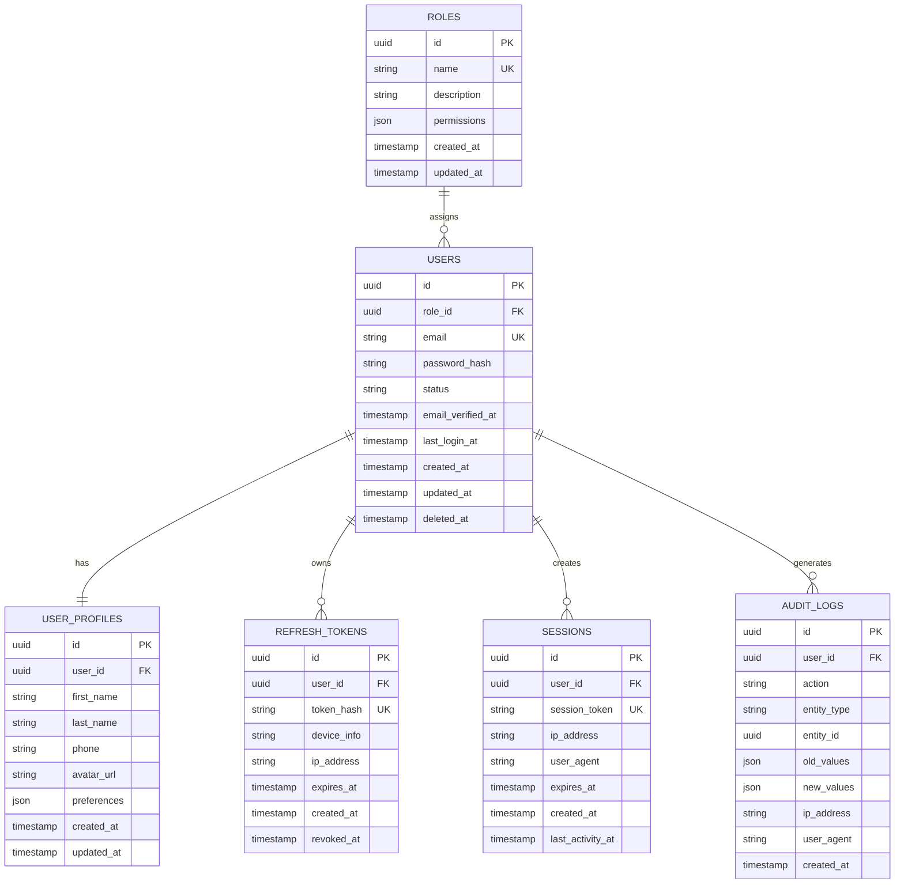

# Backend Architecture & Database Design - Sprint 1

## 1. Database Schema

### ER Diagram



### 1.1 Roles Table
```sql
CREATE TABLE roles (
    id              UUID PRIMARY KEY DEFAULT gen_random_uuid(),
    name            VARCHAR(50) UNIQUE NOT NULL,    -- 'admin', 'user', 'moderator'
    description     TEXT,
    permissions     JSONB DEFAULT '{}',              -- { "users": ["read", "write"], ... }
    created_at      TIMESTAMP WITH TIME ZONE DEFAULT NOW(),
    updated_at      TIMESTAMP WITH TIME ZONE DEFAULT NOW()
);
```

### 1.2 Users Table
```sql
CREATE TABLE users (
    id                  UUID PRIMARY KEY DEFAULT gen_random_uuid(),
    role_id             UUID REFERENCES roles(id) ON DELETE SET NULL,
    email               VARCHAR(255) UNIQUE NOT NULL,
    password_hash       VARCHAR(255) NOT NULL,       -- bcrypt hash
    status              VARCHAR(20) DEFAULT 'active', -- 'active', 'inactive', 'suspended', 'pending'
    email_verified_at   TIMESTAMP WITH TIME ZONE,
    last_login_at       TIMESTAMP WITH TIME ZONE,
    created_at          TIMESTAMP WITH TIME ZONE DEFAULT NOW(),
    updated_at          TIMESTAMP WITH TIME ZONE DEFAULT NOW(),
    deleted_at          TIMESTAMP WITH TIME ZONE     -- soft delete
);

CREATE INDEX idx_users_email ON users(email);
CREATE INDEX idx_users_status ON users(status);
```

### 1.3 User Profiles Table
```sql
CREATE TABLE user_profiles (
    id              UUID PRIMARY KEY DEFAULT gen_random_uuid(),
    user_id         UUID REFERENCES users(id) ON DELETE CASCADE,
    first_name      VARCHAR(100),
    last_name       VARCHAR(100),
    phone           VARCHAR(20),
    avatar_url      VARCHAR(500),
    preferences     JSONB DEFAULT '{}',              -- { "theme": "dark", "language": "th" }
    created_at      TIMESTAMP WITH TIME ZONE DEFAULT NOW(),
    updated_at      TIMESTAMP WITH TIME ZONE DEFAULT NOW()
);

CREATE INDEX idx_profiles_user_id ON user_profiles(user_id);
```

### 1.4 Refresh Tokens Table
```sql
CREATE TABLE refresh_tokens (
    id              UUID PRIMARY KEY DEFAULT gen_random_uuid(),
    user_id         UUID REFERENCES users(id) ON DELETE CASCADE,
    token_hash      VARCHAR(255) UNIQUE NOT NULL,   -- SHA-256 hash of token
    device_info     VARCHAR(255),                   -- "Chrome 120.0 / macOS"
    ip_address      INET,
    expires_at      TIMESTAMP WITH TIME ZONE NOT NULL,
    created_at      TIMESTAMP WITH TIME ZONE DEFAULT NOW(),
    revoked_at      TIMESTAMP WITH TIME ZONE
);

CREATE INDEX idx_refresh_tokens_user_id ON refresh_tokens(user_id);
CREATE INDEX idx_refresh_tokens_hash ON refresh_tokens(token_hash);
CREATE INDEX idx_refresh_tokens_expires ON refresh_tokens(expires_at);
```

### 1.5 Sessions Table
```sql
CREATE TABLE sessions (
    id                  UUID PRIMARY KEY DEFAULT gen_random_uuid(),
    user_id             UUID REFERENCES users(id) ON DELETE CASCADE,
    session_token       VARCHAR(255) UNIQUE NOT NULL,
    ip_address          INET,
    user_agent          TEXT,
    expires_at          TIMESTAMP WITH TIME ZONE NOT NULL,
    created_at          TIMESTAMP WITH TIME ZONE DEFAULT NOW(),
    last_activity_at    TIMESTAMP WITH TIME ZONE DEFAULT NOW()
);

CREATE INDEX idx_sessions_user_id ON sessions(user_id);
CREATE INDEX idx_sessions_token ON sessions(session_token);
```

### 1.6 Audit Logs Table
```sql
CREATE TABLE audit_logs (
    id              UUID PRIMARY KEY DEFAULT gen_random_uuid(),
    user_id         UUID REFERENCES users(id) ON DELETE SET NULL,
    action          VARCHAR(50) NOT NULL,           -- 'CREATE', 'UPDATE', 'DELETE', 'LOGIN', 'LOGOUT'
    entity_type     VARCHAR(50),                    -- 'User', 'Post', 'Comment'
    entity_id       UUID,
    old_values      JSONB,
    new_values      JSONB,
    ip_address      INET,
    user_agent      TEXT,
    created_at      TIMESTAMP WITH TIME ZONE DEFAULT NOW()
);

CREATE INDEX idx_audit_logs_user_id ON audit_logs(user_id);
CREATE INDEX idx_audit_logs_action ON audit_logs(action);
CREATE INDEX idx_audit_logs_entity ON audit_logs(entity_type, entity_id);
CREATE INDEX idx_audit_logs_created_at ON audit_logs(created_at);
```

---

## 2. API Endpoints

### Base URL: `/api/v1`

### 2.1 Authentication Endpoints

#### POST /auth/register
**Request:**
```json
{
  "email": "user@example.com",
  "password": "SecurePass123!",
  "first_name": "John",
  "last_name": "Doe",
  "phone": "+66812345678"
}
```

**Response (201 Created):**
```json
{
  "success": true,
  "data": {
    "user": {
      "id": "uuid",
      "email": "user@example.com",
      "first_name": "John",
      "last_name": "Doe",
      "role": "user",
      "created_at": "2026-02-07T10:00:00Z"
    },
    "tokens": {
      "access_token": "eyJhbGciOiJIUzI1NiIs...",
      "refresh_token": "eyJhbGciOiJIUzI1NiIs...",
      "expires_in": 900,
      "token_type": "Bearer"
    }
  }
}
```

**Error Response (400/409):**
```json
{
  "success": false,
  "error": {
    "code": "EMAIL_EXISTS",
    "message": "Email already registered"
  }
}
```

---

#### POST /auth/login
**Request:**
```json
{
  "email": "user@example.com",
  "password": "SecurePass123!",
  "device_info": "Chrome 120.0 / macOS"
}
```

**Response (200 OK):**
```json
{
  "success": true,
  "data": {
    "user": {
      "id": "uuid",
      "email": "user@example.com",
      "first_name": "John",
      "last_name": "Doe",
      "role": "user"
    },
    "tokens": {
      "access_token": "eyJhbGciOiJIUzI1NiIs...",
      "refresh_token": "eyJhbGciOiJIUzI1NiIs...",
      "expires_in": 900,
      "token_type": "Bearer"
    }
  }
}
```

**Error Response (401):**
```json
{
  "success": false,
  "error": {
    "code": "INVALID_CREDENTIALS",
    "message": "Invalid email or password"
  }
}
```

---

#### POST /auth/refresh
**Request:**
```json
{
  "refresh_token": "eyJhbGciOiJIUzI1NiIs..."
}
```

**Response (200 OK):**
```json
{
  "success": true,
  "data": {
    "access_token": "eyJhbGciOiJIUzI1NiIs...",
    "refresh_token": "eyJhbGciOiJIUzI1NiIs...",
    "expires_in": 900,
    "token_type": "Bearer"
  }
}
```

**Error Response (401):**
```json
{
  "success": false,
  "error": {
    "code": "INVALID_REFRESH_TOKEN",
    "message": "Refresh token is invalid or expired"
  }
}
```

---

#### POST /auth/logout
**Headers:**
```
Authorization: Bearer <access_token>
```

**Request:**
```json
{
  "refresh_token": "eyJhbGciOiJIUzI1NiIs..."  // optional: logout specific device
}
```

**Response (200 OK):**
```json
{
  "success": true,
  "data": {
    "message": "Successfully logged out"
  }
}
```

---

### 2.2 User Endpoints

#### GET /users/me
**Headers:**
```
Authorization: Bearer <access_token>
```

**Response (200 OK):**
```json
{
  "success": true,
  "data": {
    "id": "uuid",
    "email": "user@example.com",
    "first_name": "John",
    "last_name": "Doe",
    "phone": "+66812345678",
    "avatar_url": "https://cdn.example.com/avatars/uuid.jpg",
    "role": {
      "id": "uuid",
      "name": "user",
      "permissions": ["read:posts", "write:comments"]
    },
    "preferences": {
      "theme": "dark",
      "language": "th"
    },
    "email_verified": true,
    "last_login_at": "2026-02-07T09:30:00Z",
    "created_at": "2026-01-15T08:00:00Z"
  }
}
```

---

#### PUT /users/me
**Headers:**
```
Authorization: Bearer <access_token>
```

**Request:**
```json
{
  "first_name": "Jane",
  "last_name": "Smith",
  "phone": "+66899999999",
  "preferences": {
    "theme": "light",
    "language": "en"
  }
}
```

**Response (200 OK):**
```json
{
  "success": true,
  "data": {
    "id": "uuid",
    "email": "user@example.com",
    "first_name": "Jane",
    "last_name": "Smith",
    "phone": "+66899999999",
    "preferences": {
      "theme": "light",
      "language": "en"
    },
    "updated_at": "2026-02-07T10:05:00Z"
  }
}
```

---

## 3. Pseudocode & Flow

### 3.1 JWT Token Generation & Validation

```
FUNCTION generateTokens(userId, role, deviceInfo):
    # Access Token (short-lived)
    accessPayload = {
        sub: userId,              # subject (user id)
        role: role,               # user role
        type: "access",
        iat: now(),               # issued at
        exp: now() + 15 minutes   # expiration
    }
    accessToken = JWT.sign(accessPayload, ACCESS_SECRET, HS256)
    
    # Refresh Token (long-lived, unique)
    refreshToken = generateCryptoRandom(32 bytes)
    refreshTokenHash = SHA256(refreshToken)
    
    # Store hashed refresh token in database
    INSERT INTO refresh_tokens (
        user_id: userId,
        token_hash: refreshTokenHash,
        device_info: deviceInfo,
        ip_address: clientIP,
        expires_at: now() + 7 days
    )
    
    RETURN {
        access_token: accessToken,
        refresh_token: refreshToken,
        expires_in: 900
    }


FUNCTION validateAccessToken(token):
    TRY:
        decoded = JWT.verify(token, ACCESS_SECRET, HS256)
        
        IF decoded.type != "access":
            THROW Error("Invalid token type")
        
        IF decoded.exp < now():
            THROW Error("Token expired")
        
        # Check if user still exists and is active
        user = SELECT * FROM users WHERE id = decoded.sub
        IF NOT user OR user.status != "active":
            THROW Error("User inactive")
        
        RETURN decoded
        
    CATCH JWTError:
        THROW Error("Invalid token")


FUNCTION refreshAccessToken(refreshToken):
    # Hash the provided refresh token
    tokenHash = SHA256(refreshToken)
    
    # Find in database
    storedToken = SELECT * FROM refresh_tokens 
                  WHERE token_hash = tokenHash 
                  AND revoked_at IS NULL
    
    IF NOT storedToken:
        THROW Error("Invalid refresh token")
    
    IF storedToken.expires_at < now():
        THROW Error("Refresh token expired")
    
    # Get user info
    user = SELECT * FROM users WHERE id = storedToken.user_id
    
    # Rotate refresh token (security best practice)
    # Revoke old token
    UPDATE refresh_tokens SET revoked_at = now() WHERE id = storedToken.id
    
    # Generate new token pair
    newTokens = generateTokens(user.id, user.role, storedToken.device_info)
    
    RETURN newTokens
```

---

### 3.2 Password Hashing

```
CONSTANTS:
    BCRYPT_COST = 12           # work factor (higher = slower but more secure)
    MIN_PASSWORD_LENGTH = 8
    MAX_PASSWORD_LENGTH = 128


FUNCTION hashPassword(plainPassword):
    # Validate password strength
    IF length(plainPassword) < MIN_PASSWORD_LENGTH:
        THROW Error("Password must be at least 8 characters")
    
    IF NOT contains(plainPassword, [uppercase, lowercase, number, special]):
        THROW Error("Password must contain uppercase, lowercase, number, and special character")
    
    # Generate bcrypt hash
    salt = bcrypt.genSaltSync(BCRYPT_COST)
    hash = bcrypt.hashSync(plainPassword, salt)
    
    RETURN hash


FUNCTION verifyPassword(plainPassword, storedHash):
    RETURN bcrypt.compareSync(plainPassword, storedHash)


FUNCTION changePassword(userId, currentPassword, newPassword):
    user = SELECT * FROM users WHERE id = userId
    
    IF NOT verifyPassword(currentPassword, user.password_hash):
        THROW Error("Current password is incorrect")
    
    newHash = hashPassword(newPassword)
    
    UPDATE users SET 
        password_hash = newHash,
        updated_at = now()
    WHERE id = userId
    
    # Security: Revoke all refresh tokens
    UPDATE refresh_tokens SET revoked_at = now() 
    WHERE user_id = userId AND revoked_at IS NULL
    
    # Log the action
    createAuditLog(userId, "PASSWORD_CHANGED", "User", userId)
```

---

### 3.3 Session Management

```
FUNCTION createSession(userId, request):
    sessionToken = generateCryptoRandom(32 bytes)
    
    INSERT INTO sessions (
        user_id: userId,
        session_token: sessionToken,
        ip_address: request.ip,
        user_agent: request.headers["user-agent"],
        expires_at: now() + 24 hours,
        created_at: now(),
        last_activity_at: now()
    )
    
    # Update user's last login time
    UPDATE users SET last_login_at = now() WHERE id = userId
    
    RETURN sessionToken


FUNCTION validateSession(sessionToken):
    session = SELECT * FROM sessions WHERE session_token = sessionToken
    
    IF NOT session:
        THROW Error("Invalid session")
    
    IF session.expires_at < now():
        DELETE FROM sessions WHERE id = session.id
        THROW Error("Session expired")
    
    # Update last activity
    UPDATE sessions SET last_activity_at = now() WHERE id = session.id
    
    RETURN session


FUNCTION getActiveSessions(userId):
    sessions = SELECT 
        id, device_info, ip_address, created_at, last_activity_at
    FROM sessions 
    WHERE user_id = userId AND expires_at > now()
    ORDER BY last_activity_at DESC
    
    RETURN sessions


FUNCTION terminateSession(sessionId, userId):
    # Verify session belongs to user
    session = SELECT * FROM sessions WHERE id = sessionId AND user_id = userId
    
    IF NOT session:
        THROW Error("Session not found")
    
    DELETE FROM sessions WHERE id = sessionId
    
    createAuditLog(userId, "SESSION_TERMINATED", "Session", sessionId)


FUNCTION cleanupExpiredSessions():
    # Run as scheduled job (e.g., every hour)
    deleted = DELETE FROM sessions WHERE expires_at < now()
    deleted += DELETE FROM refresh_tokens WHERE expires_at < now() AND revoked_at IS NULL
    
    LOG "Cleaned up {deleted} expired sessions/tokens"
```

---

## 4. Middleware Flow

```
FUNCTION authMiddleware(request):
    # 1. Extract token from header
    authHeader = request.headers["authorization"]
    IF NOT authHeader OR NOT startsWith(authHeader, "Bearer "):
        RETURN 401 { error: "Missing or invalid authorization header" }
    
    token = substring(authHeader, 7)
    
    # 2. Validate token
    TRY:
        decoded = validateAccessToken(token)
    CATCH error:
        RETURN 401 { error: error.message }
    
    # 3. Attach user to request
    request.userId = decoded.sub
    request.userRole = decoded.role
    
    # 4. Continue to handler
    RETURN next()


FUNCTION auditMiddleware(request):
    # Execute after handler
    response = await next()
    
    # Log if it's a mutating operation
    IF request.method IN ["POST", "PUT", "PATCH", "DELETE"]:
        createAuditLog(
            userId: request.userId,
            action: request.method,
            entityType: getEntityType(request.path),
            entityId: request.params.id,
            ipAddress: request.ip,
            userAgent: request.headers["user-agent"]
        )
    
    RETURN response
```

---

## 5. Security Considerations

| Aspect | Implementation |
|--------|----------------|
| **Password Storage** | bcrypt with cost factor 12 |
| **Token Storage** | Access token: client memory only, Refresh token: httpOnly cookie or secure storage |
| **Token Rotation** | New refresh token issued on every refresh |
| **Rate Limiting** | 5 login attempts per 15 minutes per IP |
| **Session Timeout** | Access: 15 min, Refresh: 7 days, Session: 24 hours |
| **Audit Logging** | All authentication events and data mutations logged |
| **HTTPS** | All endpoints require TLS 1.3 |
| **CORS** | Whitelist allowed origins only |

---

## 6. Folder Structure (Suggested)

```
backend/
├── src/
│   ├── config/
│   │   ├── database.js
│   │   └── jwt.js
│   ├── controllers/
│   │   ├── auth.controller.js
│   │   └── user.controller.js
│   ├── middleware/
│   │   ├── auth.middleware.js
│   │   ├── audit.middleware.js
│   │   └── rate-limit.middleware.js
│   ├── models/
│   │   ├── user.model.js
│   │   ├── role.model.js
│   │   ├── refresh-token.model.js
│   │   ├── session.model.js
│   │   └── audit-log.model.js
│   ├── routes/
│   │   ├── auth.routes.js
│   │   └── user.routes.js
│   ├── services/
│   │   ├── auth.service.js
│   │   ├── user.service.js
│   │   ├── jwt.service.js
│   │   ├── password.service.js
│   │   └── audit.service.js
│   ├── utils/
│   │   ├── crypto.js
│   │   └── validators.js
│   └── app.js
├── migrations/
├── tests/
└── package.json
```

---

*Document Version: 1.0*  
*Sprint: 1*  
*Last Updated: 2026-02-07*
