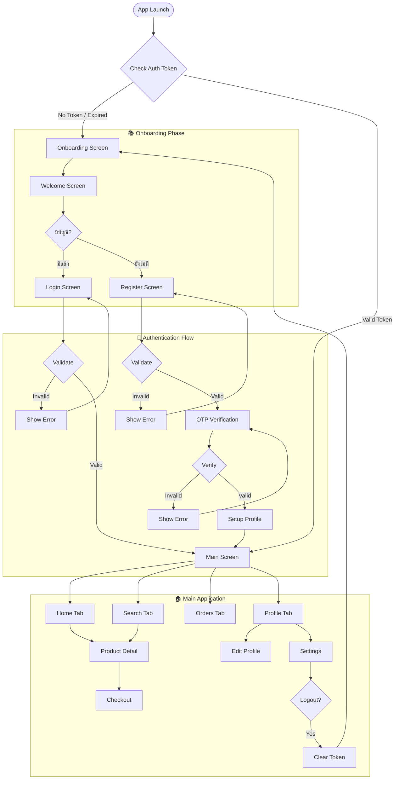
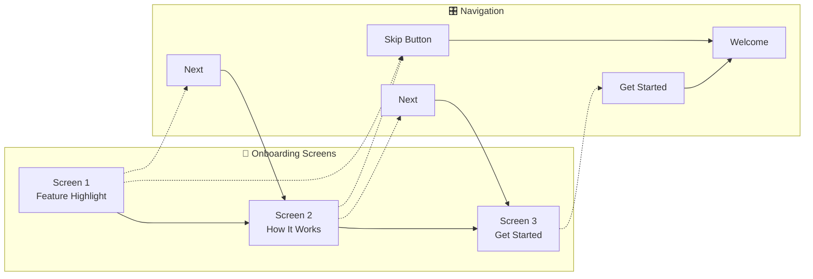
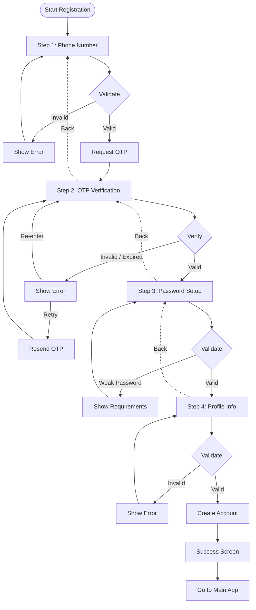
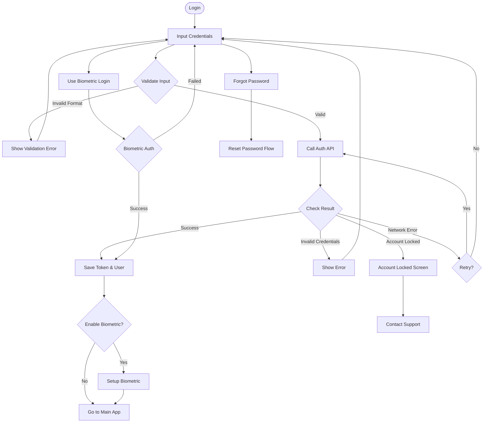
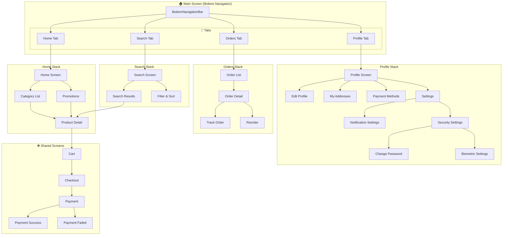
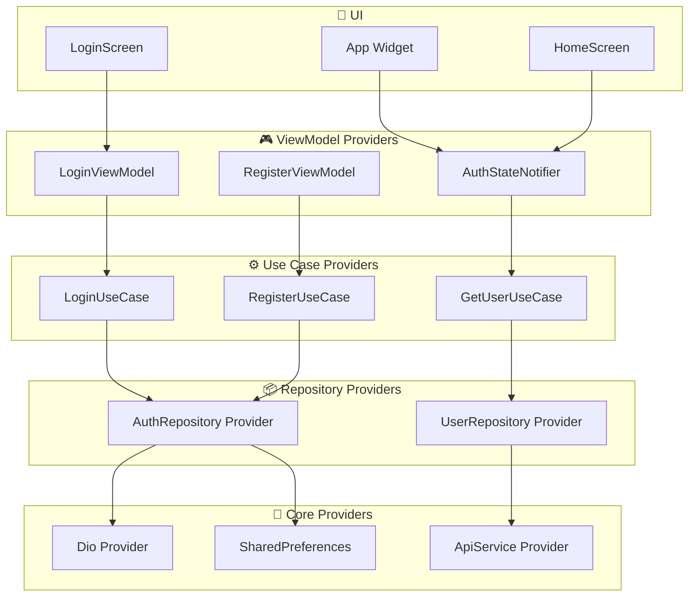

# Mobile Architecture & UI/UX Flow - Sprint 1

> **Prepared by:** บีม (Mobile Lead)  
> **Sprint:** Sprint 1 - Foundation & Authentication  
> **Date:** 7 กุมภาพันธ์ 2026

---

## 📋 Table of Contents

1. [Mobile Architecture](#1-mobile-architecture)
2. [UI/UX Flow Diagram](#2-uiux-flow-diagram)
3. [Component Structure](#3-component-structure)
4. [State Management Strategy](#4-state-management-strategy)
5. [Appendix: Tech Stack](#appendix-tech-stack)

---

## 1. Mobile Architecture

### 1.1 การเลือก Pattern: Clean Architecture + MVVM

เราเลือกใช้ **Clean Architecture** ร่วมกับ **MVVM (Model-View-ViewModel)** เพื่อให้ได้โค้ดที่:
- **Testable**: แยกส่วน business logic ออกจาก UI ชัดเจน
- **Maintainable**: แต่ละ layer มี responsibility ชัดเจน
- **Scalable**: ง่ายต่อการเพิ่ม feature ใหม่ในอนาคต
- **Framework Independent**: เปลี่ยน UI framework ได้โดยไม่กระทบ business logic

```
┌─────────────────────────────────────────────────────────────────┐
│                        PRESENTATION LAYER                        │
│  ┌─────────────┐    ┌─────────────┐    ┌─────────────────────┐  │
│  │    View     │◄──►│  ViewModel  │◄──►│   State (Riverpod)  │  │
│  │  (Screens)  │    │  (BLoC/VM)  │    │                     │  │
│  └─────────────┘    └──────┬──────┘    └─────────────────────┘  │
└─────────────────────────────┼────────────────────────────────────┘
                              │
                              ▼
┌─────────────────────────────────────────────────────────────────┐
│                         DOMAIN LAYER                             │
│  ┌─────────────┐    ┌─────────────┐    ┌─────────────────────┐  │
│  │   Entity    │    │  Use Cases  │    │  Repository Interface│  │
│  │  (Models)   │◄──►│  (Business) │◄──►│    (Contracts)      │  │
│  └─────────────┘    └─────────────┘    └─────────────────────┘  │
└─────────────────────────────────────────────────────────────────┘
                              │
                              ▼
┌─────────────────────────────────────────────────────────────────┐
│                          DATA LAYER                              │
│  ┌─────────────┐    ┌─────────────┐    ┌─────────────────────┐  │
│  │ Repository  │◄──►│   Models    │◄──►│   Data Sources      │  │
│  │  (Impl)     │    │  (DTO/Mappers)│   │ (API/Local/Cache)   │  │
│  └─────────────┘    └─────────────┘    └─────────────────────┘  │
└─────────────────────────────────────────────────────────────────┘
```

### 1.2 Layer Definitions

#### 📱 Presentation Layer
| Component | Responsibility | Example |
|-----------|----------------|---------|
| **View (Screen)** | UI Rendering, User Input | LoginScreen, HomeScreen |
| **ViewModel** | UI Logic, State Transformation | LoginViewModel, HomeViewModel |
| **State** | UI State Management | AuthState, HomeState |

#### 🎯 Domain Layer
| Component | Responsibility | Example |
|-----------|----------------|---------|
| **Entity** | Core Business Objects | User, Product, Order |
| **Use Case** | Single Business Operation | LoginUseCase, RegisterUseCase |
| **Repository Interface** | Data Access Contract | IUserRepository, IProductRepository |

#### 💾 Data Layer
| Component | Responsibility | Example |
|-----------|----------------|---------|
| **Repository Impl** | Data Coordination | UserRepositoryImpl |
| **DTO/Model** | Data Transfer Objects | UserDto, UserMapper |
| **Data Source** | Actual Data Access | AuthApiService, LocalStorageService |

### 1.3 Dependency Flow (Dependency Rule)

```
         ┌─────────────────┐
         │  External (API) │
         └────────┬────────┘
                  │
         ┌────────▼────────┐
         │  Data Layer     │ ──► Repository Implementation
         │  (Framework)    │     DTOs, API Clients
         └────────┬────────┘
                  │
         ┌────────▼────────┐
         │  Domain Layer   │ ──► Entities, Use Cases
         │  (Business)     │     Repository Interfaces
         └────────┬────────┘
                  │
         ┌────────▼────────┐
         │  Presentation   │ ──► UI, ViewModels, State
         │  (UI)           │
         └─────────────────┘
```

**หลักสำคัญ:** Dependencies ชี้เข้าหา Domain Layer เท่านั้น (Inward Pointing)

### 1.4 Dependency Injection Setup

เราใช้ **GetIt** เป็น Service Locator ร่วมกับ **Injectable** สำหรับ code generation:

```dart
// lib/di/injection.dart
import 'package:get_it/get_it.dart';
import 'package:injectable/injectable.dart';

final getIt = GetIt.instance;

@InjectableInit()
void configureDependencies() => getIt.init();
```

```dart
// lib/di/modules/data_module.dart
@module
abstract class DataModule {
  @singleton
  Dio get dio => Dio(BaseOptions(baseUrl: AppConfig.apiBaseUrl));
  
  @singleton
  @preResolve
  Future<SharedPreferences> get prefs => SharedPreferences.getInstance();
}
```

```dart
// lib/di/modules/repository_module.dart
@module
abstract class RepositoryModule {
  @singleton
  IAuthRepository get authRepository => AuthRepositoryImpl(
    getIt<AuthApiService>(),
    getIt<LocalStorageService>(),
  );
}
```

```dart
// lib/di/modules/usecase_module.dart
@module  
abstract class UseCaseModule {
  @singleton
  LoginUseCase get loginUseCase => LoginUseCase(getIt<IAuthRepository>());
  
  @singleton
  RegisterUseCase get registerUseCase => RegisterUseCase(getIt<IAuthRepository>());
  
  @singleton
  GetCurrentUserUseCase get getCurrentUserUseCase => 
    GetCurrentUserUseCase(getIt<IAuthRepository>());
}
```

---

## 2. UI/UX Flow Diagram

### 2.1 Overall App Flow



### 2.2 Onboarding Flow (Detailed)



**Onboarding Screen Specs:**
| Screen | Content | CTA |
|--------|---------|-----|
| Screen 1 | App Value Proposition, Hero Image | Next, Skip |
| Screen 2 | Key Features (3-4 items) | Next, Skip |
| Screen 3 | Call to Action, Get Started | Get Started |

### 2.3 Registration Flow (Detailed)



### 2.4 Login Flow (Detailed)



### 2.5 Main App Structure (Navigation)



---

## 3. Component Structure

### 3.1 Folder Structure

```
lib/
├── main.dart
├── app.dart
├── config/                          # Configuration
│   ├── app_config.dart
│   ├── theme/
│   │   ├── app_theme.dart
│   │   ├── app_colors.dart
│   │   ├── app_typography.dart
│   │   └── app_dimensions.dart
│   └── routes/
│       ├── app_router.dart
│       └── route_names.dart
├── core/                            # Core utilities
│   ├── constants/
│   ├── errors/
│   ├── network/
│   ├── storage/
│   ├── utils/
│   └── extensions/
├── di/                              # Dependency Injection
│   ├── injection.dart
│   └── modules/
│       ├── data_module.dart
│       ├── repository_module.dart
│       └── usecase_module.dart
├── domain/                          # Domain Layer
│   ├── entities/
│   ├── repositories/
│   └── usecases/
├── data/                            # Data Layer
│   ├── models/
│   ├── repositories/
│   ├── datasources/
│   │   ├── local/
│   │   └── remote/
│   └── mappers/
├── presentation/                    # Presentation Layer
│   ├── shared/                      # Shared Components
│   ├── screens/                     # Screen Components
│   └── state/                       # State Management
└── test/
```

### 3.2 Shared Components

#### 🧩 Base Components
```dart
// lib/presentation/shared/components/

abstract class AppComponents {
  // Buttons
  static Widget primaryButton({...})
  static Widget secondaryButton({...})
  static Widget textButton({...})
  static Widget iconButton({...})
  
  // Inputs
  static Widget textField({...})
  static Widget passwordField({...})
  static Widget searchField({...})
  static Widget otpField({...})
  static Widget phoneField({...})
  
  // Cards
  static Widget productCard({...})
  static Widget orderCard({...})
  static Widget promoCard({...})
  
  // Feedback
  static Widget loadingIndicator({...})
  static Widget errorWidget({...})
  static Widget emptyState({...})
  static Widget snackbar({...})
  
  // Layout
  static Widget appBar({...})
  static Widget bottomNavBar({...})
  static Widget skeletonLoader({...})
}
```

#### Component Hierarchy

```
┌─────────────────────────────────────────────────────────────────┐
│                     SHARED COMPONENTS                            │
├─────────────────────────────────────────────────────────────────┤
│                                                                  │
│  ┌─────────────────┐  ┌─────────────────┐  ┌─────────────────┐  │
│  │    BUTTONS      │  │  INPUT FIELDS   │  │     CARDS       │  │
│  │                 │  │                 │  │                 │  │
│  │ • PrimaryButton │  │ • TextField     │  │ • ProductCard   │  │
│  │ • SecondaryBtn  │  │ • PasswordField │  │ • OrderCard     │  │
│  │ • GhostButton   │  │ • PhoneField    │  │ • PromoCard     │  │
│  │ • IconButton    │  │ • OTPField      │  │ • AddressCard   │  │
│  │ • LoadingButton │  │ • SearchField   │  │ • PaymentCard   │  │
│  └─────────────────┘  └─────────────────┘  └─────────────────┘  │
│                                                                  │
│  ┌─────────────────┐  ┌─────────────────┐  ┌─────────────────┐  │
│  │    FEEDBACK     │  │    LAYOUT       │  │   NAVIGATION    │  │
│  │                 │  │                 │  │                 │  │
│  │ • LoadingWidget │  │ • AppBar        │  │ • BottomNavBar  │  │
│  │ • ErrorWidget   │  │ • Scaffold      │  │ • TabBar        │  │
│  │ • EmptyState    │  │ • SafeArea      │  │ • Drawer        │  │
│  │ • Snackbar      │  │ • ScrollView    │  │ • BackButton    │  │
│  │ • Dialog        │  │ • Slivers       │  │ • StepIndicator │  │
│  └─────────────────┘  └─────────────────┘  └─────────────────┘  │
│                                                                  │
└─────────────────────────────────────────────────────────────────┘
```

### 3.3 Screen Components

#### Screen Composition Pattern

```dart
// lib/presentation/screens/login/

// login_screen.dart - Main Screen Widget
class LoginScreen extends ConsumerWidget {
  @override
  Widget build(BuildContext context, WidgetRef ref) {
    final state = ref.watch(loginViewModelProvider);
    
    return Scaffold(
      appBar: const AuthAppBar(),
      body: LoginBody(state: state),
      bottomNavigationBar: LoginFooter(),
    );
  }
}

// widgets/login_body.dart
class LoginBody extends StatelessWidget {
  final LoginState state;
  
  @override
  Widget build(BuildContext context) {
    return Padding(
      padding: AppDimensions.screenPadding,
      child: Column(
        children: [
          const LoginHeader(),           // ชื่อ screen, คำอธิบาย
          const SizedBox(height: 32),
          LoginForm(state: state),        // Form หลัก
          const SizedBox(height: 16),
          const SocialLoginSection(),     // Social login options
        ],
      ),
    );
  }
}

// widgets/login_form.dart
class LoginForm extends ConsumerWidget {
  final LoginState state;
  
  @override
  Widget build(BuildContext context, WidgetRef ref) {
    return Form(
      child: Column(
        children: [
          PhoneInput(controller: _phoneController),
          const SizedBox(height: 16),
          PasswordInput(controller: _passwordController),
          const SizedBox(height: 8),
          const ForgotPasswordLink(),
          const SizedBox(height: 24),
          LoginButton(
            isLoading: state.isLoading,
            onPressed: () => _handleLogin(ref),
          ),
        ],
      ),
    );
  }
}
```

#### Screen Component Tree

```
Screen (ConsumerWidget)
    ├── AppBar (Shared)
    ├── Body (Screen-specific)
    │     ├── Header (Screen-specific)
    │     ├── Form (Screen-specific)
    │     │     ├── Input Fields (Shared)
    │     │     └── Validation Messages (Shared)
    │     ├── Actions (Screen-specific)
    │     └── Alternative Options (Screen-specific)
    └── Footer/BottomNav (Shared or Screen-specific)
```

### 3.4 Navigation Structure

#### App Router Setup (GoRouter)

```dart
// lib/config/routes/app_router.dart

final appRouter = GoRouter(
  initialLocation: RouteNames.splash,
  debugLogDiagnostics: true,
  redirect: (context, state) {
    // Global redirect logic (auth check)
    final isAuthenticated = ref.read(authStateProvider).isAuthenticated;
    final isAuthRoute = state.matchedLocation.startsWith('/auth');
    
    if (!isAuthenticated && !isAuthRoute) return '/auth/login';
    if (isAuthenticated && isAuthRoute) return '/home';
    return null;
  },
  routes: [
    // Splash & Onboarding
    GoRoute(
      path: RouteNames.splash,
      builder: (context, state) => const SplashScreen(),
    ),
    GoRoute(
      path: RouteNames.onboarding,
      builder: (context, state) => const OnboardingScreen(),
    ),
    
    // Auth Routes (Shell Route)
    ShellRoute(
      builder: (context, state, child) => AuthShell(child: child),
      routes: [
        GoRoute(
          path: RouteNames.login,
          builder: (context, state) => const LoginScreen(),
        ),
        GoRoute(
          path: RouteNames.register,
          builder: (context, state) => const RegisterScreen(),
        ),
        GoRoute(
          path: RouteNames.forgotPassword,
          builder: (context, state) => const ForgotPasswordScreen(),
        ),
        GoRoute(
          path: RouteNames.otpVerify,
          builder: (context, state) => OtpScreen(
            phone: state.extra as String,
          ),
        ),
      ],
    ),
    
    // Main App (StatefulShellRoute for BottomNav)
    StatefulShellRoute.indexedStack(
      builder: (context, state, navigationShell) => MainScreen(
        navigationShell: navigationShell,
      ),
      branches: [
        // Home Branch
        StatefulShellBranch(
          routes: [
            GoRoute(
              path: RouteNames.home,
              builder: (context, state) => const HomeScreen(),
              routes: [
                GoRoute(
                  path: 'product/:id',
                  builder: (context, state) => ProductDetailScreen(
                    productId: state.pathParameters['id']!,
                  ),
                ),
              ],
            ),
          ],
        ),
        // Search Branch
        StatefulShellBranch(
          routes: [
            GoRoute(
              path: RouteNames.search,
              builder: (context, state) => const SearchScreen(),
            ),
          ],
        ),
        // Orders Branch
        StatefulShellBranch(
          routes: [
            GoRoute(
              path: RouteNames.orders,
              builder: (context, state) => const OrdersScreen(),
            ),
          ],
        ),
        // Profile Branch
        StatefulShellBranch(
          routes: [
            GoRoute(
              path: RouteNames.profile,
              builder: (context, state) => const ProfileScreen(),
              routes: [
                GoRoute(
                  path: 'edit',
                  builder: (context, state) => const EditProfileScreen(),
                ),
                GoRoute(
                  path: 'settings',
                  builder: (context, state) => const SettingsScreen(),
                ),
              ],
            ),
          ],
        ),
      ],
    ),
  ],
);
```

#### Route Names

```dart
// lib/config/routes/route_names.dart

abstract class RouteNames {
  // Onboarding
  static const String splash = '/';
  static const String onboarding = '/onboarding';
  
  // Auth
  static const String login = '/auth/login';
  static const String register = '/auth/register';
  static const String forgotPassword = '/auth/forgot-password';
  static const String otpVerify = '/auth/otp';
  static const String resetPassword = '/auth/reset-password';
  
  // Main
  static const String home = '/home';
  static const String search = '/search';
  static const String orders = '/orders';
  static const String profile = '/profile';
  
  // Product
  static const String productDetail = '/product/:id';
  static const String cart = '/cart';
  static const String checkout = '/checkout';
  
  // Profile Sub-routes
  static const String editProfile = '/profile/edit';
  static const String addresses = '/profile/addresses';
  static const String paymentMethods = '/profile/payment';
  static const String settings = '/profile/settings';
}
```

---

## 4. State Management Strategy

### 4.1 Solution: Riverpod 2.x

เราเลือกใช้ **Riverpod** เพราะ:
- **Compile-safe**: จับ error ตั้งแต่ compile time
- **Flexible**: รองรับหลาย patterns (Provider, StateNotifier, AsyncNotifier, FutureProvider)
- **Testable**: ง่ายต่อการ mock และ test
- **Performance**: Automatic caching และ selective rebuild
- **DevTools**: มีเครื่องมือ debug ที่ดี

### 4.2 State Management Architecture

```
┌─────────────────────────────────────────────────────────────────┐
│                      STATE LAYERS                                │
├─────────────────────────────────────────────────────────────────┤
│                                                                  │
│  ┌─────────────────────────────────────────────────────────┐   │
│  │                    UI LAYER                              │   │
│  │                                                         │   │
│  │  ConsumerWidget / ConsumerStatefulWidget                │   │
│  │         │                                               │   │
│  │         ▼                                               │   │
│  │  ┌─────────────┐    ref.watch(provider)                 │   │
│  │  │    View     │◄────────────────────                   │   │
│  │  │             │                                       │   │
│  │  │  • Rebuild  │    ref.read(provider.notifier)        │   │
│  │  │    on state │────────────────────►                  │   │
│  │  │    change   │                                       │   │
│  │  └─────────────┘                                       │   │
│  └─────────────────────────────────────────────────────────┘   │
│                              │                                   │
│                              ▼                                   │
│  ┌─────────────────────────────────────────────────────────┐   │
│  │              STATE CONTROLLER LAYER                      │   │
│  │                                                         │   │
│  │  ┌─────────────────┐    ┌─────────────────┐             │   │
│  │  │  StateNotifier  │    │  AsyncNotifier  │             │   │
│  │  │                 │    │                 │             │   │
│  │  │  • Simple State │    │  • Async State  │             │   │
│  │  │  • UI State     │    │  • API Calls    │             │   │
│  │  │  • Form State   │    │  • Side Effects │             │   │
│  │  └─────────────────┘    └─────────────────┘             │   │
│  │                                                         │   │
│  │  State: immutable, copyWith pattern                     │   │
│  └─────────────────────────────────────────────────────────┘   │
│                              │                                   │
│                              ▼                                   │
│  ┌─────────────────────────────────────────────────────────┐   │
│  │              BUSINESS LOGIC LAYER                        │   │
│  │                                                         │   │
│  │  ┌─────────────────┐    ┌─────────────────┐             │   │
│  │  │    Use Cases    │    │  Repositories   │             │   │
│  │  │                 │    │                 │             │   │
│  │  │  • Validate     │    │  • Data Access  │             │   │
│  │  │  • Transform    │    │  • Cache        │             │   │
│  │  │  • Orchestrate  │    │  • Sync         │             │   │
│  │  └─────────────────┘    └─────────────────┘             │   │
│  └─────────────────────────────────────────────────────────┘   │
│                                                                  │
└─────────────────────────────────────────────────────────────────┘
```

### 4.3 State Flow Diagram

```mermaid
flowchart TD
    subgraph UI["📱 UI Layer"]
        Screen[LoginScreen]
        Screen -->|build| RenderUI[Render UI]
        Screen -->|ref.watch| GetState[Get State]
    end
    
    subgraph Controller["🎮 State Controller"]
        VM[LoginViewModel<br/>AsyncNotifier]
        State[LoginState]
        VM --> State
    end
    
    subgraph Business["⚙️ Business Layer"]
        UC[LoginUseCase]
        Repo[AuthRepository]
        UC --> Repo
    end
    
    subgraph Data["💾 Data Layer"]
        API[AuthApiService]
        Local[LocalStorage]
        Repo --> API
        Repo --> Local
    end
    
    %% User Interaction Flow
    User([User]) -->|Tap Login| Screen
    Screen -->|ref.read<br/>.login()| VM
    
    %% Processing Flow
    VM -->|Execute| UC
    UC -->|Call| Repo
    Repo -->|HTTP| API
    API -.->|Response| Repo
    Repo -.->|Save Token| Local
    
    %% State Update Flow
    Repo -.->|Result| UC
    UC -.->|Result| VM
    VM -.->|Update| State
    State -.->|Notify| GetState
    GetState -.->|Rebuild| RenderUI
    
    %% States
    subgraph States["🔄 State Transitions"]
        S1[Initial]
        S2[Loading]
        S3[Success]
        S4[Error]
        
        S1 -->|login()| S2
        S2 -->|Success| S3
        S2 -->|Failure| S4
        S4 -->|Retry| S2
        S3 -->|Reset| S1
    end
```

### 4.4 Provider Structure

```dart
// lib/presentation/state/providers/

// ==================== AUTH PROVIDERS ====================

// Auth State (Global)
final authStateProvider = StateNotifierProvider<AuthStateNotifier, AuthState>((ref) {
  return AuthStateNotifier(
    getCurrentUserUseCase: ref.watch(getCurrentUserUseCaseProvider),
    logoutUseCase: ref.watch(logoutUseCaseProvider),
  );
});

// Login ViewModel (Feature-specific)
final loginViewModelProvider = AsyncNotifierProvider<LoginViewModel, LoginState>(() {
  return LoginViewModel();
});

class LoginViewModel extends AsyncNotifier<LoginState> {
  late final LoginUseCase _loginUseCase;
  
  @override
  LoginState build() {
    _loginUseCase = ref.watch(loginUseCaseProvider);
    return const LoginState.initial();
  }
  
  Future<void> login(String phone, String password) async {
    state = const AsyncLoading();
    
    final result = await _loginUseCase(
      LoginParams(phone: phone, password: password),
    );
    
    result.fold(
      (failure) => state = AsyncError(failure, StackTrace.current),
      (user) {
        state = AsyncData(LoginState.success(user));
        ref.read(authStateProvider.notifier).setAuthenticated(user);
      },
    );
  }
}

// ==================== FORM PROVIDERS ====================

// Form State (Local, auto-dispose)
final loginFormProvider = StateProvider.autoDispose<LoginFormState>((ref) {
  return const LoginFormState();
});

// Form Validation (Computed)
final isLoginFormValidProvider = Provider.autoDispose<bool>((ref) {
  final form = ref.watch(loginFormProvider);
  return form.phone.isValid && form.password.isValid;
});

// ==================== DATA PROVIDERS ====================

// API Data (Future/Stream)
final userProfileProvider = FutureProvider.autoDispose<User>((ref) async {
  final getUser = ref.watch(getUserUseCaseProvider);
  final result = await getUser(const NoParams());
  return result.getOrThrow();
});

// Cached Data (KeepAlive)
final productsProvider = FutureProvider<List<Product>>((ref) async {
  final getProducts = ref.watch(getProductsUseCaseProvider);
  return await getProducts(const NoParams()).then((r) => r.getOrThrow());
});
```

### 4.5 State Classes

```dart
// lib/presentation/state/login/login_state.dart

@freezed
class LoginState with _$LoginState {
  const factory LoginState.initial() = _Initial;
  const factory LoginState.loading() = _Loading;
  const factory LoginState.success(User user) = _Success;
  const factory LoginState.error(AuthFailure failure) = _Error;
}

@freezed
class LoginFormState with _$LoginFormState {
  const factory LoginFormState({
    @Default(PhoneInput.pure()) PhoneInput phone,
    @Default(PasswordInput.pure()) PasswordInput password,
    @Default(false) bool isPasswordVisible,
    @Default(false) bool rememberMe,
  }) = _LoginFormState;
  
  const LoginFormState._();
  
  bool get isValid => phone.isValid && password.isValid;
}

// Form Input Validation (using formz)
class PhoneInput extends FormzInput<String, PhoneValidationError> {
  const PhoneInput.pure() : super.pure('');
  const PhoneInput.dirty([super.value = '']) : super.dirty();
  
  @override
  PhoneValidationError? validator(String value) {
    if (value.isEmpty) return PhoneValidationError.empty;
    if (!RegExp(r'^[0-9]{10}$').hasMatch(value)) {
      return PhoneValidationError.invalid;
    }
    return null;
  }
}

enum PhoneValidationError { empty, invalid }
```

### 4.6 Provider Dependency Graph



---

## Appendix: Tech Stack

### 🎯 Core Framework
| Category | Technology | Version | Reason |
|----------|-----------|---------|--------|
| Framework | Flutter | 3.16+ | Cross-platform, great performance |
| Language | Dart | 3.0+ | Null safety, modern features |

### 📦 State Management
| Package | Version | Purpose |
|---------|---------|---------|
| flutter_riverpod | ^2.4.x | State management |
| riverpod_annotation | ^2.3.x | Code generation |

### 🧭 Navigation
| Package | Version | Purpose |
|---------|---------|---------|
| go_router | ^13.0.x | Declarative routing |
| go_router_builder | ^2.4.x | Route code generation |

### 💉 Dependency Injection
| Package | Version | Purpose |
|---------|---------|---------|
| get_it | ^7.6.x | Service locator |
| injectable | ^2.3.x | Code generation |

### 🌐 Networking
| Package | Version | Purpose |
|---------|---------|---------|
| dio | ^5.4.x | HTTP client |
| retrofit | ^4.0.x | Type-safe API |
| json_serializable | ^6.7.x | JSON parsing |

### 🗄️ Local Storage
| Package | Version | Purpose |
|---------|---------|---------|
| shared_preferences | ^2.2.x | Simple key-value |
| hive | ^2.2.x | NoSQL database |
| flutter_secure_storage | ^9.0.x | Secure storage |

### ✅ Validation & Forms
| Package | Version | Purpose |
|---------|---------|---------|
| formz | ^0.6.x | Form validation |
| freezed_annotation | ^2.4.x | Immutable classes |

### 🔒 Authentication
| Package | Version | Purpose |
|---------|---------|---------|
| local_auth | ^2.2.x | Biometric auth |
| crypto | ^3.0.x | Encryption |

### 🎨 UI Components
| Package | Version | Purpose |
|---------|---------|---------|
| flutter_screenutil | ^5.9.x | Responsive UI |
| shimmer | ^3.0.x | Loading skeletons |
| cached_network_image | ^3.3.x | Image caching |

### 📊 Development
| Package | Version | Purpose |
|---------|---------|---------|
| flutter_lints | ^3.0.x | Lint rules |
| build_runner | ^2.4.x | Code generation |
| mockito | ^5.4.x | Testing mocks |

---

## 📝 Summary

### Architecture Highlights
1. **Clean Architecture** - Separation of concerns, testable
2. **MVVM Pattern** - Clear View/ViewModel separation
3. **Riverpod** - Modern, compile-safe state management
4. **GoRouter** - Type-safe declarative navigation

### Sprint 1 Focus
- ✅ Onboarding flow (3 screens)
- ✅ Authentication (Login/Register/OTP)
- ✅ Bottom navigation structure
- ✅ Foundation for future features

### Next Steps
1. Set up project structure
2. Configure DI and initial providers
3. Implement Onboarding screens
4. Build Auth flow with API integration
5. Set up main app shell with bottom nav

---

*Document นี้จัดทำโดย บีม (Mobile Lead) สำหรับ Sprint 1 Planning*
